<picture>
  <source media="(max-width: 600px)" srcset="assets/terminal-narrow.svg">
  
</picture>

### Things I've put on npm

| Tool | What it does | Try it |
| --- | --- | --- |
| [skillsync-team](https://www.npmjs.com/package/skillsync-team) | Git-native skill sharing for AI coding agents. | `npm i -g skillsync-team` |
| [claude-pin](https://www.npmjs.com/package/claude-pin) | Bookmarks for the sessions worth keeping. | `npm i -g claude-pin` |
| [huurradar](https://www.npmjs.com/package/huurradar) | The Dutch rental market, minus the refreshing. | `npx huurradar` |
| [huischeck](https://www.npmjs.com/package/huischeck) | Paste a listing. Get the verdict the ad won't give you. | `npx huischeck` |

### What I reach for

**AI** agents · RAG · LLM apps · evals · voice · computer vision &nbsp;·&nbsp; **Web** React · Next.js · Tailwind &nbsp;·&nbsp; **Backend** Laravel · Node · Python &nbsp;·&nbsp; **Data** Postgres · MySQL · SQLite

[omardev.xyz](https://omardev.xyz) · [LinkedIn](https://www.linkedin.com/in/omar-nassar-ai) · [omarnassar1127@gmail.com](mailto:omarnassar1127@gmail.com)

The terminal above is an SVG rebuilt every night by a GitHub Action from live GitHub and npm numbers. Source in [`scripts/build.py`](scripts/build.py).
